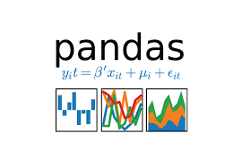

  

<!--   -->

 

##  About Meee   
-  My name is **Ratin Kumar**
-  I'm a student of **B.Tech Computer Science** in **India**
-  I am interested in **Web Development** , **Machine Learning** and **Data Science**
-  My favourite language for **DSA** and **general programming** is **C++**
-  **Fun fact:** My *smartness* 💡 lies in my *laziness* 😴
-  Ask me about programming in general, I am always
available to help and learn together.

 

## My GitHub Status 

 

 

## My Skills

- **Programming Languages**
<table>
 <tbody>
  <tr>
   <td align="center" >
    
   </td>
   <td align="center" width="50%">
    
   </td>
  </tr>
 
<tr>
<td align="center" >
 
</td>
<td align="center" width="50%">
 
</td>
</tr>

</tbody>
</table>

- **Web Development**
<table>
<tbody>
 <tr>
<td align="center" width="33%">
 
</td>
<td align="center" width="33%">
 
</td>
<td align="center" width="33%">
 
</td>
</tr>

 <tr>
<td align="center" width="33%">
 
</td>

<!--<td align="center" width="33%">
 
</td>
</tr>-->

</tbody>
</table>

- **Machine Learning and Data Science**
<table>
<tbody>
 <tr>
<td align="center" width="33%">
 
</td>
<td align="center" width="33%">
 
</td>
<td align="center" width="33%">
 
</td>
 </td>
<td align="center" width="33%">
 
</td>
</tr>

</tbody>
</table>

                                       
 
                                     
## I am Open to Opportunities

 
 

## Want to know more? 
  
  
  

